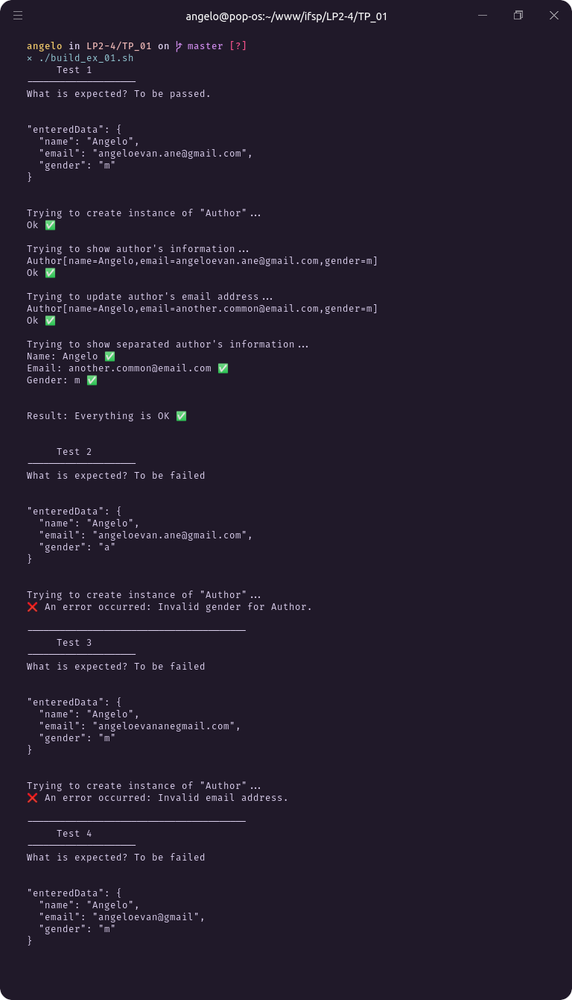
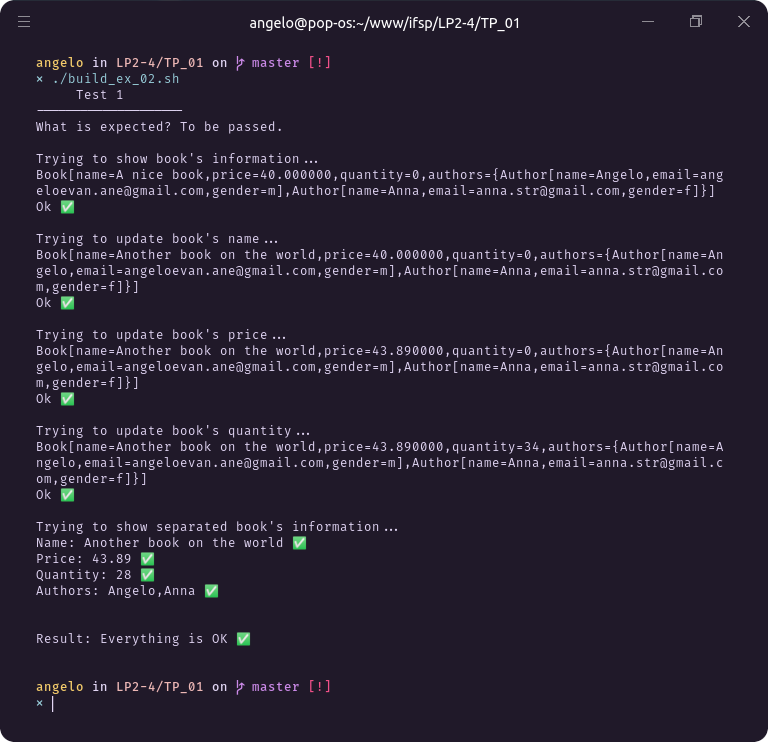
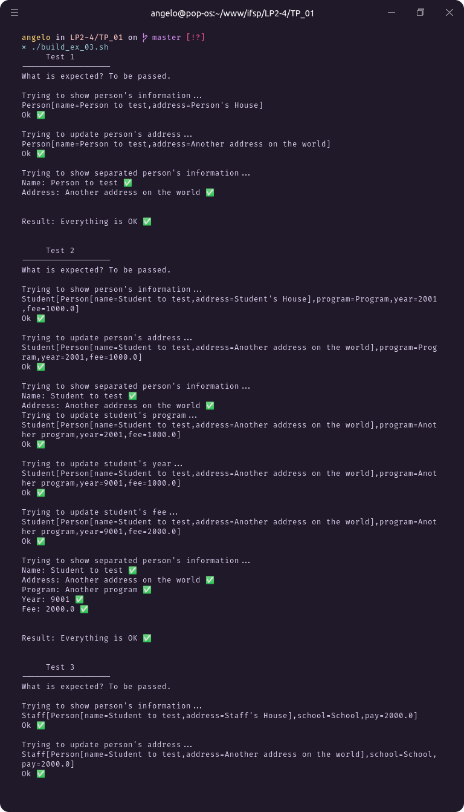

# Trabalho prático 01

## Vosso sumário

- <a href="#exercício-01">Exercício 01</a>
- <a href="#exercício-02">Exercício 02</a>
- <a href="#exercício-03">Exercício 03</a>

## Exercício 01

**Como executar:**

```bash
# compilando o projeto
javac -sourcepath ./EX_01/src/ EX_01/src/AuthorTest.java -d ./build

# Executando
java -cp ./build/ AuthorTest
```

Ou simplemente execute o script `build_ex_01.sh` 😉

```bash
./build_ex_01.sh
```

### Resultado

<div align="center">



</div>

## Exercício 02

**Como executar:**

```bash
# compilando o projeto
javac -sourcepath ./EX_01_02/src/ EX_01_02/src/Book/Test.java -d ./build

# Executando
java -cp ./build/ Book.Test
```

Ou simplemente execute o script `build_ex_02.sh` 😉

```bash
./build_ex_02.sh
```

### Resultado

<div align="center">



</div>

## Exercício 03

**Como executar:**

```bash
# compilando o projeto
javac -sourcepath ./EX_03/src/ EX_03/src/Person/Test.java -d ./build

# Executando
java -cp ./build/ Person.Test
```

Ou simplemente execute o script `build_ex_03.sh` 😉

```bash
./build_ex_03.sh
```

### Resultado

<div align="center">



</div>
